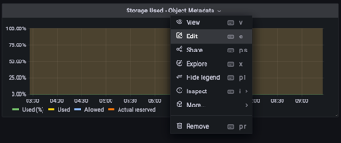

= 使用Prometheus和Grafana來延長指標保留時間
:allow-uri-read: 

_Aron Klein_

[role="lead"]
本技術報告提供使用StorageGRID 外部Prometheus和Grafana服務設定NetApp供應鏈11.6的詳細說明。

== 簡介

支援使用Prometheus儲存指標、並透過內建的Grafana儀表板提供這些指標的視覺效果。StorageGRID透過StorageGRID 設定用戶端存取憑證、並為指定的用戶端啟用Prometheus存取、可從功能表安全存取Prometheus指標。目前、保留此度量資料的能力受管理節點的儲存容量限制。為了獲得更長的持續時間、以及建立自訂的這些指標視覺效果、我們將部署新的Prometheus和Grafana伺服器、設定新伺服器、從StorageGRID執行個體中掃描指標、並建立一個儀表板、其中包含對我們來說非常重要的指標。您可以取得更多有關在中收集的Prometheus指標的資訊 https://["本文檔StorageGRID"^]。

== 聯盟Prometheus

=== 實驗室詳細資料

就本例而言、我將使用所有虛擬機器來StorageGRID 執行VMware 11.6節點、以及使用一個DEBIAN11伺服器。此解決方法介面設定了公開信任的CA憑證。StorageGRID此範例將不會安裝及設定StorageGRID 整個作業系統或是安裝的Debian Linux。您可以使用Prometheus和Grafana所支援的任何Linux風格。Prometheus和Grafana都可以安裝成Docker容器、從來源或預先編譯的二進位檔建置。在此範例中、我會將Prometheus和Grafana二進位檔案直接安裝在同一部的Debian伺服器上。請從下載並遵循基本安裝指示 https://[] 和 https://[] 分別。

=== 設定StorageGRID 驗證以供Prometheus用戶端存取

若要存取StorageGRID儲存的Prometheus指標、您必須使用私密金鑰產生或上傳用戶端憑證、並啟用用戶端的權限。這個介面必須具有SSL憑證。StorageGRID此憑證必須由Prometheus伺服器信任、或是由信任的CA信任、如果是自行簽署、則必須手動信任。若要瞭解更多資訊、請造訪 https://["本文檔StorageGRID"]。

. 在「功能區管理」介面中、選取左下角的「組態」、然後在「安全性」下的第二欄中、按一下「憑證」StorageGRID 。
. 在「憑證」頁面上、選取「用戶端」索引標籤、然後按一下「新增」按鈕。
. 提供將被授予存取權並使用此憑證的用戶端名稱。按一下「權限」下方的方塊、位於「允許Prometheus」前面、然後按一下「繼續」按鈕。
+
image::../media/prometheus/cert_name.png[憑證名稱]

. 如果您有CA簽署的憑證、您可以選取「上傳憑證」的選項按鈕、但在我們的案例中StorageGRID 、我們要選擇「產生憑證」的選項按鈕、讓流程無法產生用戶端憑證。必填欄位將會顯示以供填寫。輸入用戶端伺服器的FQDN、伺服器的IP、主旨及有效天數。然後按一下「產生」按鈕。
+
image::../media/prometheus/cert_detail.png[憑證詳細資料]

[NOTE]
====
 Be mindful of the certificate days valid entry as you will need to renew this certificate in both StorageGRID and the Prometheus server before it expires to maintain uninterrupted collection.
====
. 下載憑證pem檔案和私密金鑰pem檔案。
+

[NOTE]
====
 This is the only time you can download the private key, so make sure you do not skip this step.
====

=== 準備Linux伺服器以進行Prometheus安裝

在安裝Prometheus之前、我想要讓Prometheus使用者、目錄結構做好準備、並設定度量儲存位置的容量。

. 建立Prometheus使用者。
+
[source, console]
----
sudo useradd -M -r -s /bin/false Prometheus
----
. 建立Prometheus、用戶端憑證和指標資料的目錄。
+
[source, console]
----
sudo mkdir /etc/Prometheus /etc/Prometheus/cert /var/lib/Prometheus
----
. 我使用ext4檔案系統來格式化我所使用的磁碟以保留指標。
+
[listing]
----
mkfs -t ext4 /dev/sdb
----
. 然後、我將檔案系統掛載到Prometheus度量目錄。
+
[listing]
----
sudo mount -t auto /dev/sdb /var/lib/prometheus/
----
. 取得您用於度量資料的磁碟uuid。
+
[listing]
----
sudo ls -al /dev/disk/by-uuid/
   lrwxrwxrwx 1 root root   9 Aug 18 17:02 9af2c5a3-bfc2-4ec1-85d9-ebab850bb4a1 -> ../../sdb
----
. 在/etc/fstb/中新增項目、使掛載會在重新開機後持續使用/dev/sdb的uuid。
+
[listing]
----
/etc/fstab
UUID=9af2c5a3-bfc2-4ec1-85d9-ebab850bb4a1 /var/lib/prometheus	ext4	defaults	0	0
----

=== 安裝及設定Prometheus

現在伺服器已經準備好、我可以開始安裝Prometheus並設定服務。

. 擷取Prometheus安裝套件
+
[source, console]
----
tar xzf prometheus-2.38.0.linux-amd64.tar.gz
----
. 將二進位檔複製到/usr/local/bin、並將擁有權變更為先前建立的Prometheus使用者
+
[source, console]
----
sudo cp prometheus-2.38.0.linux-amd64/{prometheus,promtool} /usr/local/bin
sudo chown prometheus:prometheus /usr/local/bin/{prometheus,promtool}
----
. 將主控台和程式庫複製到/etc/Prometheus
+
[source, console]
----
sudo cp -r prometheus-2.38.0.linux-amd64/{consoles,console_libraries} /etc/prometheus/
----
. 將先前從StorageGRID 下列網址下載的用戶端憑證和私密金鑰pem檔案複製到/etc/Prometheus/certs
. 建立Prometheus組態yaml檔案
+
[source, console]
----
sudo nano /etc/prometheus/prometheus.yml
----
. 插入下列組態。工作名稱可以是您想要的任何內容。將「-targets：[']"（目標：[']"）變更為管理節點的FQDN、如果您變更了憑證名稱和私密金鑰檔名、請更新TLS_config區段以進行比對。然後儲存檔案。如果您的網格管理介面使用自我簽署的憑證、請下載該憑證並將其與具有唯一名稱的用戶端憑證一起放置、然後在TLS_config區段中新增ca_file:/etc/Prometheus/cert /UCERT.pem
+
.. 在此範例中、我會收集所有以alertmanager、Cassandra、節點和StorageGRID VMware為開頭的指標。如需有關Prometheus指標的詳細資訊、請參閱 https://["本文檔StorageGRID"^]。
+
[source, yaml]
----
# my global config
global:
  scrape_interval: 60s # Set the scrape interval to every 15 seconds. Default is every 1 minute.

scrape_configs:
  - job_name: 'StorageGRID'
    honor_labels: true
    scheme: https
    metrics_path: /federate
    scrape_interval: 60s
    scrape_timeout: 30s
    tls_config:
      cert_file: /etc/prometheus/cert/certificate.pem
      key_file: /etc/prometheus/cert/private_key.pem
    params:
      match[]:
        - '{__name__=~"alertmanager_.*|cassandra_.*|node_.*|storagegrid_.*"}'
    static_configs:
    - targets: ['sgdemo-rtp.netapp.com:9091']
----

[NOTE]
====
如果您的網格管理介面使用自我簽署的憑證、請下載該憑證、並以唯一名稱將其與用戶端憑證一起放置。在「TLs_config」區段中、將憑證新增到用戶端憑證和私密金鑰行上方

....
        ca_file: /etc/prometheus/cert/UIcert.pem
....
====
. 將/etc/Prometheus中所有檔案和目錄的擁有權、以及/var/lib/Prometheus變更為Prometheus使用者
+
[source, console]
----
sudo chown -R prometheus:prometheus /etc/prometheus/
sudo chown -R prometheus:prometheus /var/lib/prometheus/
----
. 在/etc/systemd/system中建立Prometheus服務檔案
+
[source, console]
----
sudo nano /etc/systemd/system/prometheus.service
----
. 請插入下列行、並記下#--storage．tsdb.retitation.times=1y#、將度量資料的保留時間設為1年。或者、您也可以使用#-storage、tsdb、retrite.size=300GiB#來根據儲存限制來保留基礎資料。這是唯一可設定保留指標的位置。
+
[source, console]
----
[Unit]
Description=Prometheus Time Series Collection and Processing Server
Wants=network-online.target
After=network-online.target

[Service]
User=prometheus
Group=prometheus
Type=simple
ExecStart=/usr/local/bin/prometheus \
        --config.file /etc/prometheus/prometheus.yml \
        --storage.tsdb.path /var/lib/prometheus/ \
        --storage.tsdb.retention.time=1y \
        --web.console.templates=/etc/prometheus/consoles \
        --web.console.libraries=/etc/prometheus/console_libraries

[Install]
WantedBy=multi-user.target
----
. 重新載入systemd服務以註冊新的Prometheus服務。然後啟動並啟用Prometheus服務。
+
[source, console]
----
sudo systemctl daemon-reload
sudo systemctl start prometheus
sudo systemctl enable prometheus
----
. 檢查服務是否正常運作
+
[source, console]
----
sudo systemctl status prometheus
----
+
[listing]
----
● prometheus.service - Prometheus Time Series Collection and Processing Server
     Loaded: loaded (/etc/systemd/system/prometheus.service; enabled; vendor preset: enabled)
     Active: active (running) since Mon 2022-08-22 15:14:24 EDT; 2s ago
   Main PID: 6498 (prometheus)
      Tasks: 13 (limit: 28818)
     Memory: 107.7M
        CPU: 1.143s
     CGroup: /system.slice/prometheus.service
             └─6498 /usr/local/bin/prometheus --config.file /etc/prometheus/prometheus.yml --storage.tsdb.path /var/lib/prometheus/ --web.console.templates=/etc/prometheus/consoles --web.con>

Aug 22 15:14:24 aj-deb-prom01 prometheus[6498]: ts=2022-08-22T19:14:24.510Z caller=head.go:544 level=info component=tsdb msg="Replaying WAL, this may take a while"
Aug 22 15:14:24 aj-deb-prom01 prometheus[6498]: ts=2022-08-22T19:14:24.816Z caller=head.go:615 level=info component=tsdb msg="WAL segment loaded" segment=0 maxSegment=1
Aug 22 15:14:24 aj-deb-prom01 prometheus[6498]: ts=2022-08-22T19:14:24.816Z caller=head.go:615 level=info component=tsdb msg="WAL segment loaded" segment=1 maxSegment=1
Aug 22 15:14:24 aj-deb-prom01 prometheus[6498]: ts=2022-08-22T19:14:24.816Z caller=head.go:621 level=info component=tsdb msg="WAL replay completed" checkpoint_replay_duration=55.57µs wal_rep>
Aug 22 15:14:24 aj-deb-prom01 prometheus[6498]: ts=2022-08-22T19:14:24.831Z caller=main.go:997 level=info fs_type=EXT4_SUPER_MAGIC
Aug 22 15:14:24 aj-deb-prom01 prometheus[6498]: ts=2022-08-22T19:14:24.831Z caller=main.go:1000 level=info msg="TSDB started"
Aug 22 15:14:24 aj-deb-prom01 prometheus[6498]: ts=2022-08-22T19:14:24.831Z caller=main.go:1181 level=info msg="Loading configuration file" filename=/etc/prometheus/prometheus.yml
Aug 22 15:14:24 aj-deb-prom01 prometheus[6498]: ts=2022-08-22T19:14:24.832Z caller=main.go:1218 level=info msg="Completed loading of configuration file" filename=/etc/prometheus/prometheus.y>
Aug 22 15:14:24 aj-deb-prom01 prometheus[6498]: ts=2022-08-22T19:14:24.832Z caller=main.go:961 level=info msg="Server is ready to receive web requests."
Aug 22 15:14:24 aj-deb-prom01 prometheus[6498]: ts=2022-08-22T19:14:24.832Z caller=manager.go:941 level=info component="rule manager" msg="Starting rule manager..."
----
. 您現在應該可以瀏覽至Prometheus伺服器的UI http://[] 並查看UI
+
image::../media/prometheus/prometheus_ui.png[Prometheus UI頁面]

. 在「Status（狀態）」目標下、您可以看到StorageGRID 我們在Prometheus.yml中設定的這個端點的狀態
+
image::../media/prometheus/prometheus_targets.png[Prometheus狀態功能表]

+
image::../media/prometheus/prometheus_target_status.png[Prometheus目標頁面]

. 在「圖表」頁面上、您可以執行測試查詢、並驗證資料是否已成功擷取。例如、在查詢列中輸入「storagegrid節點_cpu使用率百分比」、然後按一下「執行」按鈕。
+
image::../media/prometheus/prometheus_execute.png[執行Prometheus查詢]

== 安裝及設定Grafana

現在Prometheus已經安裝完成且正常運作、我們可以繼續安裝Grafana並設定儀表板

=== Grafana安裝

. 安裝最新的Grafana企業版
+
[source, console]
----
sudo apt-get install -y apt-transport-https
sudo apt-get install -y software-properties-common wget
sudo wget -q -O /usr/share/keyrings/grafana.key https://packages.grafana.com/gpg.key
----
. 為穩定版本新增此儲存庫：
+
[source, console]
----
echo "deb [signed-by=/usr/share/keyrings/grafana.key] https://packages.grafana.com/enterprise/deb stable main" | sudo tee -a /etc/apt/sources.list.d/grafana.list
----
. 新增儲存庫之後。
+
[source, console]
----
sudo apt-get update
sudo apt-get install grafana-enterprise
----
. 重新載入systemd服務以登錄新的grafana服務。然後啟動並啟用Grafana服務。
+
[source, console]
----
sudo systemctl daemon-reload
sudo systemctl start grafana-server
sudo systemctl enable grafana-server.service
----
. Grafana現已安裝並執行。當您開啟瀏覽器以存取HTTP：//Prometheus-server:3000時、您將會看到Grafana登入頁面。
. 預設的登入認證為admin/admin、您應該在提示時設定新密碼。

=== 建立Grafana儀表板StorageGRID 以利執行

在安裝並執行Grafana和Prometheus之後、現在正是建立資料來源並建置儀表板來連接兩者的好時機

. 在左窗格中展開「組態」、然後選取「資料來源」、再按一下「新增資料來源」按鈕
. Prometheus將是最熱門的資料來源之一。如果不是、請使用搜尋列找出「Prometheus」
. 輸入Prometheus執行個體的URL、以及符合Prometheus時間間隔的Scp強 檔時間間隔、以設定Prometheus來源。我也停用警示區段、因為我沒有在Prometheus上設定警示管理程式。
+
image::../media/prometheus/grafana_prometheus_conf.png[GRafana Prometheus組態]

. 輸入所需的設定後、向下捲動至底部、然後按一下「Save & test（儲存並測試）」。
. 組態測試成功後、按一下「Explore（瀏覽）」按鈕。
+
.. 在「Explore（瀏覽）」視窗中、您可以使用我們使用「storagegrid節點CPU使用率百分比」測試的相同度量、然後按一下「Run query（執行查詢）」按鈕
+
image::../media/prometheus/grafana_source_explore.png[GRafana Prometheus指標探索]

. 現在我們已經設定好資料來源、就能建立儀表板。
+
.. 在左窗格中展開「儀表板」、然後選取「+ new Dashboard」
.. 選取「新增面板」
.. 選取度量來設定新的面板、我將再次使用「storagegRid_nore_cpu使用率百分比」、輸入面板的標題、展開底部的「選項」、然後將圖例變更為自訂、並輸入「｛｛instance｝｝」以定義節點名稱、並在右窗格的「Standard options」（標準選項）下、將「Unit」設為「siscs/center百（單位）。然後按一下「套用」、將面板儲存至儀表板。
+
image::../media/prometheus/grafana_panel_conf.png[設定grafana面板]

. 我們可以針對每個所需的指標、繼續打造類似的儀表板、但幸好StorageGRID 、我們已經有儀表板可供複製到我們的自訂儀表板。
+
.. 從左側窗格的「支援」選項、StorageGRID 然後在「工具」欄底部按一下「指標」。
.. 在指標中、我要選取中間欄頂端的「Grid（網格）」連結。
+

.. 從網格儀表板中、選取「使用的儲存設備-物件中繼資料」面板。按一下小向下箭頭和面板標題的結尾、即可下拉功能表。在此功能表中、選取「檢查」和「面板Json」。
+
image::../media/prometheus/storagegrid_dashboard_insp.png[資訊儀表板StorageGRID]

.. 複製Json程式碼並關閉視窗。
+
image::../media/prometheus/storagegrid_panel_inspect.png[Json StorageGRID]

.. 在新儀表板中、按一下圖示以新增面板。
+

.. 套用新的面板而不做任何變更
.. 就像StorageGRID 使用「無縫面板」一樣、請檢查Json。移除所有Json程式碼、然後從StorageGRID 「資訊畫面」中以複製的程式碼加以取代。
+

.. 編輯新的面板、右側會顯示移轉訊息、並顯示「移轉」按鈕。按一下按鈕、然後按一下「Apply（套用）」按鈕。
+

+
image::../media/prometheus/grafana_panel_edit.png[GRFANA編輯面板]

. 當您將所有面板都放在適當的位置並依自己的需求進行設定之後、按一下右上角的磁碟圖示以儲存儀表板、並為儀表板命名。

=== 結論

現在我們擁有Prometheus伺服器、可自訂資料保留和儲存容量。有了這項功能、我們就能繼續建立自己的儀表板、並提供與營運最相關的指標。您可以取得更多有關在中收集的Prometheus指標的資訊 https://["本文檔StorageGRID"^]。
