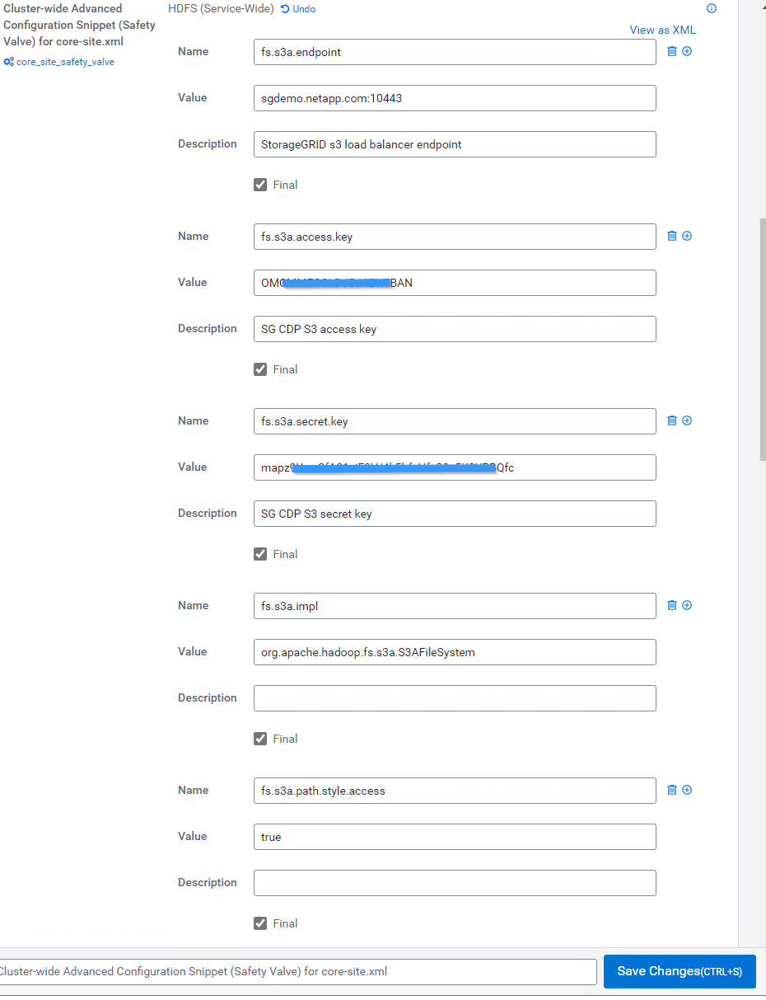
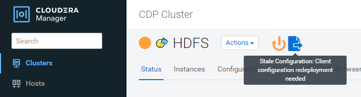

= 使用Cloudera Hadoop S3連接器StorageGRID 搭配使用
:allow-uri-read: 

[role="lead"]
Hadoop已是資料科學家的最愛、至今已有一段時間。Hadoop可利用簡單的程式設計架構、在多個電腦叢集之間分散處理大型資料集。Hadoop的設計可從單一伺服器擴充至數千部機器、每部機器都擁有本機運算和儲存設備。

== 為什麼要使用S3A來執行Hadoop工作流程？

隨著資料量隨著時間成長、使用自己的運算和儲存設備來新增機器的方法變得效率不彰。線性擴充會帶來有效使用資源和管理基礎架構的挑戰。

為了因應這些挑戰、Hadoop S3用戶端可針對S3物件儲存設備提供高效能I/O。運用S3A實作Hadoop工作流程、有助於將物件儲存設備當作資料儲存庫、並可將運算與儲存設備分開、進而獨立擴充運算與儲存設備。分離運算與儲存設備也能讓您將適當的資源投入運算工作、並根據資料集的大小提供容量。因此、您可以降低Hadoop工作流程的整體TCO。

== 設定S3A連接器以使用StorageGRID Sfor

=== 先決條件

* 適用於Hadoop S3A連線測試的SS3端點URL、租戶S3存取金鑰及秘密金鑰。StorageGRID
* 叢集中每個主機的Cloudera叢集和root或Sudo權限、可用來安裝Java套件。

截至2022年4月為止、Java 11.0.14搭配Cloudera 7.1.7已通過StorageGRID 測試、可搭配使用不過、在新安裝時、Java版本編號可能有所不同。

=== 安裝Java套件

. 請檢查 https://docs.cloudera.com/cdp-private-cloud-upgrade/latest/release-guide/topics/cdpdc-java-requirements.html["Cloudera支援對照表"^] 以取得支援的JDK版本。
. 下載 https://www.oracle.com/java/technologies/downloads/["Java 11.x套件"^] 這與Cloudera叢集作業系統相符。將此套件複製到叢集中的每個主機。在此範例中、rpm套件用於CentOS。
. 以root身分或使用具有Sudo權限的帳戶登入每個主機。在每個主機上執行下列步驟：
+
.. 安裝套件：
+
[listing]
----
$ sudo rpm -Uvh jdk-11.0.14_linux-x64_bin.rpm
----
.. 檢查Java的安裝位置。如果安裝了多個版本、請將新安裝的版本設為預設：
+
[listing, subs="specialcharacters,quotes"]
----
alternatives --config java

There are 2 programs which provide 'java'.

  Selection    Command
-----------------------------------------------
 +1           /usr/java/jre1.8.0_291-amd64/bin/java
  2           /usr/java/jdk-11.0.14/bin/java

Enter to keep the current selection[+], or type selection number: 2
----
.. 將此行新增至「/etc/profile」結尾。路徑應符合上述選擇的路徑：
+
[listing]
----
export JAVA_HOME=/usr/java/jdk-11.0.14
----
.. 執行下列命令、設定檔才會生效：
+
[listing]
----
source /etc/profile
----

=== Cloudera HDFS S3組態

*步驟*

. 從Cloudera Manager GUI中、選取叢集> HDFS、然後選取組態。
. 在「Category（類別）」下、選取「Advanced（進階）」、然後向下捲動以找到「Cluster-wide Advanced Configuration Snsetting（安全閥）for core site.xml（叢集範圍內的進階組態片段（安全閥）
. 按一下（+）符號、然後新增下列值配對。
+
[cols="1a,4a"]
|===
| 名稱 | 價值 

 a| 
fs.s3a.access.key
 a| 
_<用戶S3存取金鑰、請從StorageGRID SURE>>_取得

 a| 
fs.s3a.secret.key
 a| 
_<租 戶S3的機密金鑰來自StorageGRID 於此

 a| 
fs.s3a.connection.sse.enabled
 a| 
[true或假]（如果缺少此項目、預設為https）

 a| 
fs.s3a.端 點
 a| 
_< StorageGRID 支援S3端點：連接埠>_

 a| 
fs.s3a.impl
 a| 
org.apache.Hadoop。fs.s3a.S3AFileSystem

 a| 
fs.s3a.path.樣式.access
 a| 
[true或假]（如果缺少此項目、預設為虛擬主機樣式）

|===
+
*範例擷取畫面*

+

. 按一下「儲存變更」按鈕。從HDFS功能表列選取過時組態圖示、在下一頁選取重新啟動過時的服務、然後選取立即重新啟動。
+

== 測試S3A與StorageGRID Sfe的連線

=== 執行基本連線測試

登入Cloudera叢集中的其中一部主機、然後輸入「Hadoop FS -ls s3a：//_<stucke-name>_/」。

下列範例使用路徑syle搭配預先存在的HDFS測試儲存區和測試物件。

[listing]
----
[root@ce-n1 ~]# hadoop fs -ls s3a://hdfs-test/
22/02/15 18:24:37 WARN impl.MetricsConfig: Cannot locate configuration: tried hadoop-metrics2-s3a-file-system.properties,hadoop-metrics2.properties
22/02/15 18:24:37 INFO impl.MetricsSystemImpl: Scheduled Metric snapshot period at 10 second(s).
22/02/15 18:24:37 INFO impl.MetricsSystemImpl: s3a-file-system metrics system started
22/02/15 18:24:37 INFO Configuration.deprecation: No unit for fs.s3a.connection.request.timeout(0) assuming SECONDS
Found 1 items
-rw-rw-rw-   1 root root       1679 2022-02-14 16:03 s3a://hdfs-test/test
22/02/15 18:24:38 INFO impl.MetricsSystemImpl: Stopping s3a-file-system metrics system...
22/02/15 18:24:38 INFO impl.MetricsSystemImpl: s3a-file-system metrics system stopped.
22/02/15 18:24:38 INFO impl.MetricsSystemImpl: s3a-file-system metrics system shutdown complete.
----

=== 疑難排解

==== 案例1

使用HTTPS連線StorageGRID 進行更新、並在逾時15分鐘後收到「shipee_fuse」錯誤訊息。

*原因：*舊版JRE/JDK,使用過時或不受支援的TLS密碼套件連線StorageGRID 到S不明。

*錯誤訊息範例*

[listing]
----
[root@ce-n1 ~]# hadoop fs -ls s3a://hdfs-test/
22/02/15 18:52:34 WARN impl.MetricsConfig: Cannot locate configuration: tried hadoop-metrics2-s3a-file-system.properties,hadoop-metrics2.properties
22/02/15 18:52:34 INFO impl.MetricsSystemImpl: Scheduled Metric snapshot period at 10 second(s).
22/02/15 18:52:34 INFO impl.MetricsSystemImpl: s3a-file-system metrics system started
22/02/15 18:52:35 INFO Configuration.deprecation: No unit for fs.s3a.connection.request.timeout(0) assuming SECONDS
22/02/15 19:04:51 INFO impl.MetricsSystemImpl: Stopping s3a-file-system metrics system...
22/02/15 19:04:51 INFO impl.MetricsSystemImpl: s3a-file-system metrics system stopped.
22/02/15 19:04:51 INFO impl.MetricsSystemImpl: s3a-file-system metrics system shutdown complete.
22/02/15 19:04:51 WARN fs.FileSystem: Failed to initialize fileystem s3a://hdfs-test/: org.apache.hadoop.fs.s3a.AWSClientIOException: doesBucketExistV2 on hdfs: com.amazonaws.SdkClientException: Unable to execute HTTP request: Received fatal alert: handshake_failure: Unable to execute HTTP request: Received fatal alert: handshake_failure
ls: doesBucketExistV2 on hdfs: com.amazonaws.SdkClientException: Unable to execute HTTP request: Received fatal alert: handshake_failure: Unable to execute HTTP request: Received fatal alert: handshake_failure
----
*解析度：*請確定已安裝JDK 11.x或更新版本、並將Java程式庫設為預設值。請參閱 <<Install Java package>> 章節以取得更多資訊。

==== 案例2：

無法連線StorageGRID 至包含錯誤訊息「無法找到有效的認證路徑至要求的目標」的功能。

*原因：* StorageGRID 不受Java程式信任*不支援SS3端點伺服器憑證。

範例錯誤訊息：

[listing]
----
[root@hdp6 ~]# hadoop fs -ls s3a://hdfs-test/
22/03/11 20:58:12 WARN impl.MetricsConfig: Cannot locate configuration: tried hadoop-metrics2-s3a-file-system.properties,hadoop-metrics2.properties
22/03/11 20:58:13 INFO impl.MetricsSystemImpl: Scheduled Metric snapshot period at 10 second(s).
22/03/11 20:58:13 INFO impl.MetricsSystemImpl: s3a-file-system metrics system started
22/03/11 20:58:13 INFO Configuration.deprecation: No unit for fs.s3a.connection.request.timeout(0) assuming SECONDS
22/03/11 21:12:25 INFO impl.MetricsSystemImpl: Stopping s3a-file-system metrics system...
22/03/11 21:12:25 INFO impl.MetricsSystemImpl: s3a-file-system metrics system stopped.
22/03/11 21:12:25 INFO impl.MetricsSystemImpl: s3a-file-system metrics system shutdown complete.
22/03/11 21:12:25 WARN fs.FileSystem: Failed to initialize fileystem s3a://hdfs-test/: org.apache.hadoop.fs.s3a.AWSClientIOException: doesBucketExistV2 on hdfs: com.amazonaws.SdkClientException: Unable to execute HTTP request: PKIX path building failed: sun.security.provider.certpath.SunCertPathBuilderException: unable to find valid certification path to requested target: Unable to execute HTTP request: PKIX path building failed: sun.security.provider.certpath.SunCertPathBuilderException: unable to find valid certification path to requested target
----
*解決方案：* NetApp建議使用已知公共憑證簽署授權單位所核發的伺服器憑證、以確保驗證安全無虞。或者、將自訂CA或伺服器憑證新增至Java信任存放區。

完成下列步驟、將StorageGRID 一套完整的自訂CA或伺服器憑證新增至Java信任存放區。

. 備份現有的預設Java cacerts檔案。
+
[listing]
----
cp -ap $JAVA_HOME/lib/security/cacerts $JAVA_HOME/lib/security/cacerts.orig
----
. 將StorageGRID S3端點憑證匯入Java信任存放區。
+
[listing, subs="specialcharacters,quotes"]
----
keytool -import -trustcacerts -keystore $JAVA_HOME/lib/security/cacerts -storepass changeit -noprompt -alias sg-lb -file _<StorageGRID CA or server cert in pem format>_
----

==== 疑難排解秘訣

. 增加Hadoop記錄層級以進行偵錯。
+
'匯出Hadoop根記錄程式= Hadoop root、logger =偵錯、Console '

. 執行命令、並將記錄訊息引導至error.log。
+
「Hadoop FS -ls s3a：//_<stucke-name>_&>error.log」

