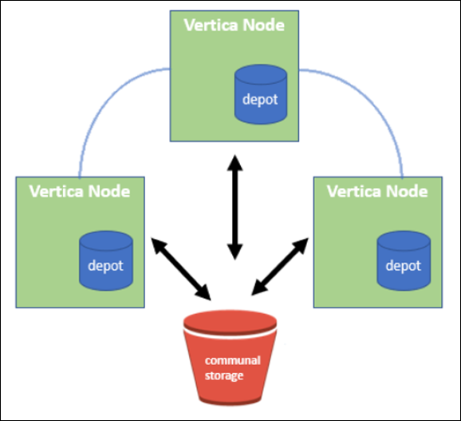

= Vertica Eon模式資料庫使用NetApp StorageGRID 功能做為共用儲存設備
:allow-uri-read: 
:icons: font
:imagesdir: ../media/

[role="lead"]
本指南說明在NetApp StorageGRID 還原上建立具有公用儲存設備的Vertica Eon Mode資料庫的程序。

== 簡介

Vertica是分析資料庫管理軟體。它是一款柱式儲存平台、專為處理大量資料而設計、可在傳統的密集環境中、提供極快的查詢效能。Vertica資料庫以兩種模式之一執行：Eon或Enterprise。您可以在內部部署或雲端部署這兩種模式。

Eon和Enterprise模式在儲存資料的位置上主要有所不同：

* Eon Mode資料庫使用公用儲存設備來儲存資料。這是Vertica推薦的。
* 企業模式資料庫會將資料儲存在本機的資料庫中、儲存在組成資料庫的節點檔案系統中。

=== Eon Mode架構

Eon Mode將運算資源與資料庫的共用儲存層區隔開來、讓運算和儲存設備能夠分開擴充。Eon Mode中的Vertica經過最佳化、可因應各種工作負載、並使用獨立的運算與儲存資源將其彼此隔離。

Eon Mode會將資料儲存在稱為公用儲存設備的共用物件儲存區中、S3儲存區是在內部部署或Amazon S3上代管。

=== 共用儲存設備

Eon Mode不會在本機儲存資料、而是使用單一共線儲存位置來儲存所有資料和目錄（中繼資料）。公用儲存設備是資料庫的集中式儲存位置、可在資料庫節點之間共用。

公用儲存設備具有下列屬性：

* 雲端或內部部署物件儲存設備中的公用儲存設備彈性較高、而且由於儲存設備故障而導致資料遺失的可能性較個別機器上磁碟上的儲存設備來得小。
* 任何資料都可以由任何使用相同路徑的節點讀取。
* 容量不受節點上磁碟空間的限制。
* 由於資料是以社群方式儲存、因此您可以彈性擴充叢集、以因應瞬息萬變的需求。如果資料儲存在節點本機上、則新增或移除節點時、需要在節點之間移動大量資料、才能將資料從要移除的節點移出、或移到新建立的節點上。

=== 維修中心

公用儲存設備的缺點之一、就是速度。從共享雲端位置存取資料的速度比從本機磁碟讀取慢。此外、如果許多節點同時從公用儲存設備讀取資料、則連線至公用儲存設備可能會成為瓶頸。為了改善資料存取速度、Eon Mode資料庫中的節點會維護本機磁碟快取、其中的資料稱為「倉儲」。執行查詢時、節點會先檢查所需的資料是否位於儲存庫中。如果是、則會使用資料的本機複本完成查詢。如果資料不在儲存庫中、節點會從公用儲存設備擷取資料、並將複本儲存在儲存庫中。

== NetApp StorageGRID 技術建議

Vertica將資料庫資料儲存至物件儲存區、儲存為數千（或數百萬）個壓縮物件（觀察到每個物件的大小為200至500MB）。當使用者執行資料庫查詢時、Vertica會使用位元組範圍Get呼叫、從這些壓縮物件平行擷取所選的資料範圍。每個位元組範圍的Get大約為8KB。

在10TB資料庫倉儲的使用者查詢測試期間、每秒傳送4、000至10、000個Get（位元組範圍Get）要求至網格。使用SG6060應用裝置執行此測試時、雖然每個應用裝置節點的CPU使用率%很低（約20%至30%）、但2/3的CPU使用時間仍在等待I/O在SGF6024上觀察到I/O等待的百分比極低（0%至0.5%）。

由於小IOPS需求高且延遲需求極低（平均應低於0.01秒）、NetApp建議將SFG6024用於物件儲存服務。如果需要SG6060來處理非常大的資料庫大小、客戶應與Vertica客戶團隊合作調整進廠規模、以支援主動查詢的資料集。

對於管理節點和API閘道節點、客戶可以使用SG100或SG1000。選項取決於並行和資料庫大小的使用者查詢要求數量。如果客戶偏好使用協力廠商負載平衡器、NetApp建議使用專屬的負載平衡器來處理高效能需求工作負載。如需StorageGRID 調整規模、請洽詢NetApp客戶團隊。

其他StorageGRID 的功能組態建議包括：

* *網格拓撲*。請勿將SGF6024與同一個網格網站上的其他儲存應用裝置機型混用。如果您偏好使用SG6060來提供長期歸檔保護、請將SGF6024與專屬的網格負載平衡器一起保留在主動式資料庫的網格站台（實體或邏輯站台）中、以提升效能。在同一個站台混合使用不同機型的應用裝置、會降低站台的整體效能。
* *資料保護*。使用Replicate複本以保護資料安全。請勿對使用中的資料庫使用銷毀編碼。客戶可以使用銷毀編碼來長期保護非作用中資料庫。
* *不啟用網格壓縮*。Vertica會先壓縮物件、再儲存至物件儲存。啟用網格壓縮不會進一步節省儲存使用量、也會大幅降低位元組範圍的效能。
* * HTTP與HTTPS S3端點連線*。在基準測試期間、我們觀察到使用HTTP S3連線從Vertica叢集到StorageGRID Es負載 平衡器端點時、效能提升約5%。此選項應根據客戶的安全需求而定。

Vertica組態的建議包括：

* *對於讀寫作業*、會啟用* Vertica資料庫預設的進廠設定（值= 1）。NetApp強烈建議您啟用這些進廠設定、以提升效能。
* *停用串流限制*。如需組態詳細資料、請參閱一節 ,停用串流限制。

== 將Eon Mode安裝在內部部署環境中、並將公用儲存設備安裝在StorageGRID 原地

以下各節說明將Eon Mode安裝在內部部署環境中、並將公用儲存設備安裝在StorageGRID 原地的程序。設定內部部署簡易儲存服務（S3）相容物件儲存設備的程序、與Vertica指南中的程序類似、 link:https://www.vertica.com/docs/10.1.x/HTML/Content/Authoring/InstallationGuide/EonOnPrem/InstallingEonOnPremiseWithMinio.htm?tocpath=Installing%20Vertica%7CInstalling%20Vertica%20For%20Eon%20Mode%20on-Premises%7C_____2["在內部部署環境中安裝Eon Mode資料庫"^]。

下列設定用於功能測試：

* 零點11.4.0.4 StorageGRID
* Vertica 10.1.0
* 三部虛擬機器（VM）搭配CentOS 7.x作業系統、可讓Vertica節點組成叢集。此設定僅適用於功能測試、不適用於Vertica正式作業資料庫叢集。

這三個節點是以安全Shell（SSH）金鑰設定、以便在叢集內的節點之間不需密碼即可執行SSH。

=== NetApp StorageGRID 產品所需資訊

若要在StorageGRID 內部部署環境中安裝Eon Mode、並將公用儲存設備安裝在原地、您必須具備下列必要資訊。

* IP位址或StorageGRID 完整網域名稱（FQDN）和端口號。如果您使用的是HTTPS、請使用StorageGRID 在S3端點上實作的自訂憑證授權單位（CA）或自我簽署SSL憑證。
* 儲存區名稱。它必須預先存在且為空白。
* 存取金鑰ID和密碼存取金鑰、並可讀寫儲存區的存取權。

=== 建立授權檔案以存取S3端點

建立存取S3端點的授權檔案時、必須符合下列先決條件：

* 已安裝Vertica。
* 叢集已設定、設定並準備好建立資料庫。

若要建立存取S3端點的授權檔案、請遵循下列步驟：

. 登入Vertica節點、執行「admintool」以建立Eon Mode資料庫。
+
預設使用者為「dbadmin」、是在Vertica叢集安裝期間建立的。

. 使用文字編輯器在「/home/DBadmin'」目錄下建立檔案。檔案名稱可以是您想要的任何內容、例如「shg_auth.conf」。
. 如果S3端點使用標準HTTP連接埠80或HTTPS連接埠443、請跳過連接埠號碼。若要使用HTTPS、請設定下列值：
+
** 「awsenablehttps = 1」、否則請將值設為「0」。
** 「awsaith =<S3存取金鑰ID>:<秘密存取金鑰>'
** 「aws端 點=<s/s3 StorageGRID 端點>:<port>'
+
若要使用自訂CA或自我簽署的SSL憑證來進行StorageGRID SESS3端點HTTPS連線、請指定憑證的完整檔案路徑和檔名。此檔案必須位於每個Vertica節點上的相同位置、並對所有使用者具有讀取權限。如果StorageGRID 由已知的CA簽署了SESS3端點SSL憑證、請跳過此步驟。

+
「awscafile =<檔案路徑/檔案名稱>」

+
例如、請參閱下列範例檔案：

+
[listing]
----
awsauth = MNVU4OYFAY2xyz123:03vuO4M4KmdfwffT8nqnBmnMVTr78Gu9wANabcxyz
awsendpoint = s3.england.connectlab.io:10443
awsenablehttps = 1
awscafile = /etc/custom-cert/grid.pem
----
+

NOTE: 在正式作業環境中、客戶應在StorageGRID 一個S3負載平衡器端點上、實作由已知CA簽署的伺服器憑證。

=== 在所有Vertica節點上選擇一個進廠路徑

在每個節點上為倉儲儲存路徑選擇或建立目錄。您為倉儲儲存路徑參數所提供的目錄必須具有下列項目：

* 叢集中所有節點的相同路徑（例如、「/home/DBadmin/depot」）
* DBAdmin使用者可讀取且可寫入
* 足夠的儲存容量
+
根據預設、Vertica會使用60%的檔案系統空間、其中包含用於倉儲儲存設備的目錄。您可以使用「cred_db」命令中的「-kepot-sizes」引數來限制庫房的大小。請參閱 link:https://www.vertica.com/blog/sizing-vertica-cluster-eon-mode-database/["調整Eon模式資料庫的Vertica叢集規模"^] 文章以瞭解一般的Vertica規模調整準則、或洽詢您的Vertica客戶經理。

+
如果不存在「admintools create_db"工具、則會嘗試為您建立一個進廠路徑。

=== 建立Eon內部部署資料庫

若要建立Eon內部部署資料庫、請遵循下列步驟：

. 若要建立資料庫、請使用「admintooles create_db]工具。
+
下列清單提供本範例中使用之引數的簡短說明。如需所有必要和選用引數的詳細說明、請參閱Vertica文件。

+
** -x <在中建立之授權檔案的路徑/檔名 ,「建立授權檔案以存取S3端點」 >。
+
授權詳細資料會在成功建立後儲存在資料庫內。您可以移除此檔案、以避免公開S3秘密金鑰。

** 公用儲存位置<S3：//storagegrid Bucketname>
** s <用於此資料庫的Vertica節點以逗號分隔的清單>
** -d <要建立的資料庫名稱>
** p <要為此新資料庫設定的密碼>。例如、請參閱下列命令範例：
+
[listing]
----
admintools -t create_db -x sg_auth.conf --communal-storage-location=s3://vertica --depot-path=/home/dbadmin/depot --shard-count=6 -s vertica-vm1,vertica-vm2,vertica-vm3 -d vmart -p '<password>'
----
+
根據資料庫的節點數、建立新資料庫需要幾分鐘的時間。第一次建立資料庫時、系統會提示您接受授權合約。

例如、請參閱下列授權檔案範例和「create db]命令：

[listing]
----
[dbadmin@vertica-vm1 ~]$ cat sg_auth.conf
awsauth = MNVU4OYFAY2CPKVXVxxxx:03vuO4M4KmdfwffT8nqnBmnMVTr78Gu9wAN+xxxx
awsendpoint = s3.england.connectlab.io:10445
awsenablehttps = 1

[dbadmin@vertica-vm1 ~]$ admintools -t create_db -x sg_auth.conf --communal-storage-location=s3://vertica --depot-path=/home/dbadmin/depot --shard-count=6 -s vertica-vm1,vertica-vm2,vertica-vm3 -d vmart -p 'xxxxxxxx'
Default depot size in use
Distributing changes to cluster.
    Creating database vmart
    Starting bootstrap node v_vmart_node0007 (10.45.74.19)
    Starting nodes:
        v_vmart_node0007 (10.45.74.19)
    Starting Vertica on all nodes. Please wait, databases with a large catalog may take a while to initialize.
    Node Status: v_vmart_node0007: (DOWN)
    Node Status: v_vmart_node0007: (DOWN)
    Node Status: v_vmart_node0007: (DOWN)
    Node Status: v_vmart_node0007: (UP)
    Creating database nodes
    Creating node v_vmart_node0008 (host 10.45.74.29)
    Creating node v_vmart_node0009 (host 10.45.74.39)
    Generating new configuration information
    Stopping single node db before adding additional nodes.
    Database shutdown complete
    Starting all nodes
Start hosts = ['10.45.74.19', '10.45.74.29', '10.45.74.39']
    Starting nodes:
        v_vmart_node0007 (10.45.74.19)
        v_vmart_node0008 (10.45.74.29)
        v_vmart_node0009 (10.45.74.39)
    Starting Vertica on all nodes. Please wait, databases with a large catalog may take a while to initialize.
    Node Status: v_vmart_node0007: (DOWN) v_vmart_node0008: (DOWN) v_vmart_node0009: (DOWN)
    Node Status: v_vmart_node0007: (DOWN) v_vmart_node0008: (DOWN) v_vmart_node0009: (DOWN)
    Node Status: v_vmart_node0007: (DOWN) v_vmart_node0008: (DOWN) v_vmart_node0009: (DOWN)
    Node Status: v_vmart_node0007: (DOWN) v_vmart_node0008: (DOWN) v_vmart_node0009: (DOWN)
    Node Status: v_vmart_node0007: (UP) v_vmart_node0008: (UP) v_vmart_node0009: (UP)
Creating depot locations for 3 nodes
Communal storage detected: rebalancing shards

Waiting for rebalance shards. We will wait for at most 36000 seconds.
Installing AWS package
    Success: package AWS installed
Installing ComplexTypes package
    Success: package ComplexTypes installed
Installing MachineLearning package
    Success: package MachineLearning installed
Installing ParquetExport package
    Success: package ParquetExport installed
Installing VFunctions package
    Success: package VFunctions installed
Installing approximate package
    Success: package approximate installed
Installing flextable package
    Success: package flextable installed
Installing kafka package
    Success: package kafka installed
Installing logsearch package
    Success: package logsearch installed
Installing place package
    Success: package place installed
Installing txtindex package
    Success: package txtindex installed
Installing voltagesecure package
    Success: package voltagesecure installed
Syncing catalog on vmart with 2000 attempts.
Database creation SQL tasks completed successfully. Database vmart created successfully.
----
[cols="1a,1a"]
|===
| 物件大小（位元組） | 鏟斗/物件金鑰完整路徑 

 a| 
"61歲"
 a| 
「s 3：//Vertica/051/026d63ae9d4a33237bf0e2c2cf2a794a00a0000s000021a07/026d63ae9d4a33237bf0e2c2cf2a794a00a0000a21a07_0_0_0_0.DFS'」

 a| 
《145》
 a| 
「s 3：//Vertica/2c4/026d63ae9d4a33237bf0e2c2cf2a794a00a000021a3d/026d63ae9d4a33237bf0e2c2c2a794a00a0000a21a3d_0_0.DFs」

 a| 
《146》
 a| 
「s 3：//Vertica/33C/026d63ae9d4a33237bf0e2c2cf2a794a00a0000s000021a1d/026d63ae9d4a33237bf0e2c2c2a794a00a0000a21a1d_0_0.dfs」

 a| 
《40》
 a| 
「s 3：//Vertica/382/026d63ae9d4a33237bf0e2c2cf2a794a00a0000s000021a31 / 026d63ae9d4a33237bf0e2c2cf2a794a00a000021a31_0_0_0.DFs」

 a| 
《145》
 a| 
「s 3：//Vertica/42f/026d63ae9d4a33237bf0e2c2cf2a794a00a0000s000021a21/026d63ae9d4a33237bf0e2c2c2cf2a794a00a0000a21a21a21a21_0_0_0_0.DFS'」

 a| 
"34"
 a| 
「s 3：//Vertica/472/026d63ae9d4a33237bf0e2c2cf2a794a00a0000s000021a25/026d63ae9d4a33237bf0e2c2cf2a794a00a000021a25_0_0_0.DFs」

 a| 
《41》
 a| 
「s 3：//Vertica/476/026d63ae9d4a33237bf0e2c2cf2a794a00a000021a2d/026d63ae9d4a33237bf0e2c2c2cf2a794a00a000021a2a2d_0_0_0_0.DFs」

 a| 
"61歲"
 a| 
「s 3：//Vertica/52A/026d63ae9d4a33237bf0e2c2cf2a794a00a000021a5d/026d63ae9d4a33237bf0e2c2c2a794a00a0000a21a5d_0_0.DFs」

 a| 
《131》
 a| 
「s 3：//Vertica/5d2/026d63ae9d4a33237bf0e2c2cf2a794a00a0000s000021a19/026d63ae9d4a33237bf0e2c2c2a794a00a0000a21a19_0_0_0.DFS'

 a| 
《91》
 a| 
「s 3：//Vertica/5f7/026d63ae9d4a33237bf0e2c2cf2a794a00a0000s000021a11/026d63ae9d4a33237bf0e2c2c2a794a00a0000a21a11_0_0_0.DFS'」

 a| 
《118》
 a| 
「s 3：//Vertica/82d/026d63ae9d4a33237bf0e2c2cf2a794a00a0000s000021a15/026d63ae9d4a33237bf0e2c2cf2a794a00a0000a21a15_0_0_0.DFs」

 a| 
《115》
 a| 
「s 3：//Vertica/9a2/026d63ae9d4a33237bf0e2c2cf2a794a00a0000s000021a61/026d63ae9d4a33237bf0e2c2c2a794a00a0000a21a61_0_0_0.DFS'」

 a| 
《33》
 a| 
「s 3：//Vertica/ACD/026d63ae9d4a33237bf0e2c2cf2a794a00a0000s000021a29 / 026d63ae9d4a33237bf0e2c2cf2a794a00a000021a29 _0_0_0.DFS'」

 a| 
《133》
 a| 
「s 3：//Vertica/b98/ 026d63ae9d4a33237bf0e2c2cf2a794a00a000021a4d/026d63ae9d4a33237bf0e2c2c2a794a00a0000a21a4d_0_0.dfs」

 a| 
《38》
 a| 
「s 3：//Vertica/db3/026d63ae9d4a33237bf0e2c2cf2a794a00a0000s000021a49/ 026d63ae9d4a33237bf0e2c2cf2a794a00a0000a21a49_0_0_0.DFS'」

 a| 
《38》
 a| 
「s 3：//Vertica/EBA / 026d63ae9d4a33237bf0e2c2cf2a794a00a0000s000021a59/026d63ae9d4a33237bf0e2c2cf2a794a00a0000a21a59_0_0_0.DFs」

 a| 
《21521920》
 a| 
「s 3：//Vertica /中繼資料/VMart/Archites/026d63ae9d4a33237bf0e2c2c2c2a794a00a00002152/026d63ae9d4a33237bf0e2c2c2a794a00a0000a0000a0000a2152.tar」

 a| 
《6865408》
 a| 
「s 3：//Vertica /中繼資料/VMart/Archites/026d63ae9d4a33237bf0e2c2cf2a794a00a000021602/026d63ae9d4a33237bf0e2c2cf2a794a00a0000a0000a2162.tar」

 a| 
《204217344》
 a| 
「s 3：//Vertica /中繼資料/VMart/Archites/026d63ae9d4a33237bf0e2c2cf2a794a00a000021610/026d63ae9d4a33237bf0e2c2cf2a794a00a0000a0000a21610.tar」

 a| 
《16109056》
 a| 
「s 3：//Vertica /中繼資料/VMart/Archites/026d63ae9d4a33237bf0e2c2cf2a794a00a0000s0000217e0/026d63ae9d4a33237bf0e2c2c2a794a00a0000a0000a0000a217e0.tar」

 a| 
《12853248》
 a| 
「s 3：//Vertica /中繼資料/VMart/Archites/026d63ae9d4a33237bf0e2c2cf2a794a00a000021800/026d63ae9d4a33237bf0e2c2cf2a794a00a0000a00a00002180.tar」

 a| 
《8937984》
 a| 
「s 3：//Vertica /中繼資料/VMart/Archites/026d63ae9d4a33237bf0e2c2cf2a794a00a0000187a/026d63ae9d4a33237bf0e2c2c2a794a00a0000a0000187a.tar]

 a| 
《56260608》
 a| 
「s 3：//Vertica /中繼資料/VMart/Archites/026d63ae9d4a33237bf0e2c2cf2a794a00a000018b2/026d63ae9d4a33237bf0e2c2c2a794a00a0000a0000a218b2.tar」

 a| 
《53947904》
 a| 
「s 3：//Vertica /中繼資料/VMart/Archites/026d63ae9d4a33237bf0e2c2cf2a794a00a0000219ba/ 026d63ae9d4a33237bf0e2c2cf2a794a00a0000a0000a219ba.tar'」

 a| 
《44932608》
 a| 
「s 3：//Vertica /中繼資料/VMart/Archites/026d63ae9d4a33237bf0e2c2cf2a794a00a00000000219de/026d63ae9d4a33237bf0e2c2cf2a794a00a0000a0000a219de.tar」

 a| 
《256306688》
 a| 
「s 3：//Vertica/mata/VMart/Archites/026d63ae9d4a33237bf0e2c2c2c2a794a00a000021a6e/026d63ae9d4a33237bf0e2c2c2c2a794a00a0000a0000a00a0000a2a6a0000a6a6a6a6a6a6a6ae.tar

 a| 
《8062464》
 a| 
「s 3：//Vertica /中繼資料/VMart/Archites/026d63ae9d4a33237bf0e2c2c2cf2a794a00a000021e34/ 026d63ae9d4a33237bf0e2c2c2a794a00a0000a00a0000a000021e34.tar]

 a| 
《20024832》
 a| 
「s 3：//Vertica /中繼資料/VMart/Archites/026d63ae9d4a33237bf0e2c2cf2a794a00a000021e70-026d63ae9d4a33237bf0e2c2c2a794a00a0000a0000a70a.tar]

 a| 
《104444》
 a| 
「s 3：//Vertica/metadmetada/VMart/叢 集_config.json」

 a| 
《822666》
 a| 
s 3：//Vertica /中繼資料/VMart/nodes/v_vmart節點0016/Catalog/859703b06a3456d95d0be28575a673/nates/c13_13/chkpt_1.cat.gz`

 a| 
"254"
 a| 
「s 3：//Vertica /中繼資料/VMart/nodes/v_v_vmart節點0016/Catalog/859703b06a3456d95d0be28575a673/checks/c13_13/completed」

 a| 
《2958》
 a| 
「s 3：//Vertica /中繼資料/VMart/nodes/v_vmart節點0016/Catalog/859703b06a3456d95d0be28573/narates/c2_2/chkpt_1.cat.gz`」

 a| 
《231》
 a| 
「s 3：//Vertica /中繼資料/VMart/nodes/v_vmart節點0016/Catalog/859703b06a3456d95d0be28575a673/nates/c2_2/completed」

 a| 
《822521》
 a| 
「s 3：//Vertica /中繼資料/VMart/nodes/v_vmart節點0016/Catalog/859703b06a3456d95d0be28573/narates/c4_4/chkpt_1.cat.gz`」

 a| 
《231》
 a| 
「s 3：//Vertica /中繼資料/VMart/nodes/v_vmart節點0016/Catalog/859703b06a3456d95d0be28575a673/checks/c4_4/completed」

 a| 
《746513》
 a| 
「s 3：//Vertica /中繼資料/VMart/nodes/v_vmart節點0016/Catalog/859703b06a3456d95d0be28575a673/Txnlogs/txn_14_g14.cat`」

 a| 
《2596》
 a| 
「s 3：//Vertica /中繼資料/VMart/nodes/v_vmart節點0016/Catalog/859703b06a3456d95d0be28575a673/Txnlogs/txn_3_g3.cat.gz`」

 a| 
《821065》
 a| 
「s 3：//Vertica /中繼資料/VMart/nodes/v_vmart節點0016/Catalog/859703b06a3456d95d0be28575a673/Txnlogs/txn_4_g4.cat.gz`」

 a| 
《6440》
 a| 
「s 3：//Vertica /中繼資料/VMart/nodes/v_vmart節點0016/Catalog/859703b06a3456d95d0be28575a673/Txnlogs/txn_5_g5.cat`」

 a| 
"8518"
 a| 
「s 3：//Vertica /中繼資料/VMart/nodes/v_vmart節點0016/Catalog/859703b06a3456d95d0be28575a673/Txnlogs/txn_8_g8.cat`」

 a| 
0
 a| 
「s 3：//Vertica /中繼資料/VMart/nodes/v_vmart節點0016/Catalog/859703b06a3456d95d0be28575a673/tiered_catalog.cat`」

 a| 
《822922》
 a| 
「s 3：//Vertica /中繼資料/VMart/nodes/v_vmart節點0017/Catalog/859703b06a3456d95d0be28573a673/narates/C14_7/chkpt_1.cat.gz`」

 a| 
"232"
 a| 
「s 3：//Vertica /中繼資料/VMart/nodes/v_vmart節點0017/Catalog/859703b06a3456d95d0be28575a673/nates/C14_7/completed」

 a| 
《822930》
 a| 
s 3：//Vertica /中繼資料/VMart/nodes/v_vmart節點0017/Catalog/859703b06a3456d95d0be2857a673/Txnlogs/txn_14_g7.cat.gz`

 a| 
《755033》
 a| 
s 3：//Vertica /中繼資料/VMart/nodes/v_vmart節點0017/Catalog/859703b06a3456d95d0be2857a673/Txnlogs/txn_15_g8.cat`

 a| 
0
 a| 
s 3：//Vertica /中繼資料/VMart/nodes/v_vmart節點0017/Catalog/859703b06a3456d95d0be2857a673/tiered_catalog.cat`

 a| 
《822922》
 a| 
「s 3：//Vertica /中繼資料/VMart/nodes/v_vmart節點0018/Catalog/859703b06a3456d95d0be28573a673/narates/C14_7/chkpt_1.cat.gz`」

 a| 
"232"
 a| 
「s 3：//Vertica /中繼資料/VMart/nodes/v_vmart節點0018/Catalog/859703b06a3456d95d0be28575a673/nates/C14_7/completed」

 a| 
《822930》
 a| 
s 3：//Vertica /中繼資料/VMart/nodes/v_vmart節點0018/Catalog/859703b06a3456d95d0be285775a673/Txnlogs/txn_14_g7.cat.gz`

 a| 
《755033》
 a| 
s 3：//Vertica /中繼資料/VMart/nodes/v_vmart節點0018/Catalog/859703b06a3456d95d0be285775a673/Txnlogs/txn_15_g8.cat`

 a| 
0
 a| 
「s 3：//Vertica /中繼資料/VMart/nodes/v_vmart節點0018/Catalog/859703b06a3456d95d0be28575a673/tiered_catalog.cat`」

|===

=== 停用串流限制

此程序以Vertica指南為基礎、適用於其他內部部署物件儲存設備、應適用於StorageGRID 下列項目：

. 建立資料庫之後、請將「AWSStreamingConnectionPercentage」組態參數設為「0」、以停用該參數。對於使用公用儲存設備的Eon Mode內部部署安裝、此設定是不必要的。此組態參數可控制VRTica用於串流讀取之物件存放區的連線數目。在雲端環境中、此設定有助於避免物件存放區的串流資料佔用所有可用的檔案處理代碼。它會保留一些檔案處理常用於其他物件存放區作業。由於內部部署物件存放區的延遲很低、因此不需要使用此選項。
. 使用「vsql」陳述式來更新參數值。密碼是您在「建立Eon內部部署資料庫」中設定的資料庫密碼。例如、請參閱下列輸出範例：

[listing]
----
[dbadmin@vertica-vm1 ~]$ vsql
Password:
Welcome to vsql, the Vertica Analytic Database interactive terminal.
Type:   \h or \? for help with vsql commands
        \g or terminate with semicolon to execute query
        \q to quit
dbadmin=> ALTER DATABASE DEFAULT SET PARAMETER AWSStreamingConnectionPercentage = 0; ALTER DATABASE
dbadmin=> \q
----

=== 正在驗證庫房設定

Vertica資料庫預設的進廠設定會啟用（值= 1）以進行讀取和寫入作業。NetApp強烈建議您啟用這些進廠設定、以提升效能。

[listing]
----
vsql -c 'show current all;' | grep -i UseDepot
DATABASE | UseDepotForReads | 1
DATABASE | UseDepotForWrites | 1
----

=== 載入範例資料（選用）

如果此資料庫即將進行測試並移除、您可以將範例資料載入此資料庫進行測試。Vertica隨附範例資料集VMart、可在每個Vertica節點的「/opt/Vertica/examples/VMart_Schema/」下找到。您可以找到此範例資料集的詳細資訊 link:https://www.vertica.com/docs/10.1.x/HTML/Content/Authoring/GettingStartedGuide/IntroducingVMart/IntroducingVMart.htm?zoom_highlight=VMart["請按這裡"^]。

請依照下列步驟載入範例資料：

. 以DBAdmin身分登入任一Vertica節點：CD /opt/Vertica/examples/VMart_Schema/
. 將範例資料載入資料庫、並在子步驟c和d中出現提示時輸入資料庫密碼：
+
.. 「CD /opt/Vertica/examples/VMart_Schema」
.. 」
.. 「vsql < vmart定義_schema.sql'
.. 「vsql < vmart載入資料.sql'

. 有多個預先定義的SQL查詢、您可以執行其中一些查詢、以確認測試資料已成功載入資料庫。例如：「vsql < vmart _queries1.sql'

== 何處可找到其他資訊

若要深入瞭解本文所述資訊、請檢閱下列文件和 / 或網站：

* link:https://docs.netapp.com/sgws-114/index.jsp["NetApp StorageGRID 供應品文件"^]
* link:https://www.netapp.com/pdf.html?item=/media/7931-ds-3613.pdf["資料表StorageGRID"^]
* link:https://www.vertica.com/documentation/vertica/10-1-x-documentation/["Vertica 10.1產品文件"^]

== 版本歷程記錄

[cols="1a,1a,2a"]
|===
| 版本 | 日期 | 文件版本歷程記錄 

 a| 
1.0版
 a| 
2021年9月
 a| 
初始版本。

|===